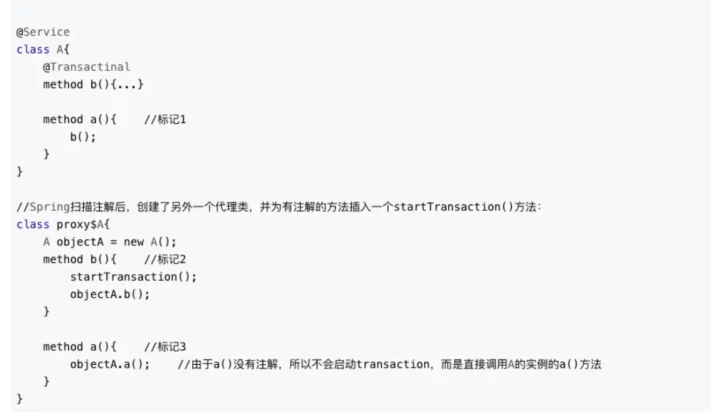

# Spring

## 1.@Async注解实现异步调用

### 1.1 什么是异步调用

异步调用对应的是同步调用，假设现在有三个无关任务等待执行，同步调用的方式是逐次等待，即第一个任务完成后再开始第二个任务....以此类推。

但是计算机可以并发执行，使用同步调用的耗时太长了，因此我们希望开三个县城去同时的处理这三个任务，这就需要使用@Async注解了

### 1.2 使用实例

```java
package com.sankuai.learn.service;

import org.springframework.scheduling.annotation.Async;
import org.springframework.scheduling.annotation.EnableAsync;
import org.springframework.stereotype.Service;

/**
 * @author dengquanliang
 * @date 2020/6/8
 */
@Service
@EnableAsync
public class TaskServiceImpl implements TaskService
{
    @Override
    @Async
    public void doTask1() throws InterruptedException {
        long startTime = System.currentTimeMillis();
        System.out.println("开始做任务一");
        Thread.sleep(10000);
        long endTime = System.currentTimeMillis();
        System.out.println("完成任务一，耗时：" + (endTime - startTime) + "当前线程：" + Thread.currentThread().getName());
    }

    @Override
    @Async
    public void doTask2() throws InterruptedException {
        long startTime = System.currentTimeMillis();
        System.out.println("开始做任务二");
        Thread.sleep(10000);
        long endTime = System.currentTimeMillis();
        System.out.println("完成任务二，耗时：" + (endTime - startTime) + "当前线程：" + Thread.currentThread().getName());
    }

    @Override
    @Async
    public void doTask3() throws InterruptedException {
        long startTime = System.currentTimeMillis();
        System.out.println("开始做任务三");
        Thread.sleep(10000);
        long endTime = System.currentTimeMillis();
        System.out.println("完成任务三，耗时：" + (endTime - startTime) + "当前线程：" + Thread.currentThread().getName());
    }
}

```

```java
package com.sankuai.learn.test.asnyc;

import com.sankuai.learn.service.TaskService;
import com.sankuai.learn.test.TestBase;
import org.junit.jupiter.api.Test;
import org.springframework.beans.factory.annotation.Autowired;

/**
 * @author dengquanliang
 * @date 2020/6/8
 */
public class AsyncTest extends TestBase {

    @Autowired
    private TaskService taskService;

    @Test
    public void test() throws InterruptedException {
        long startTime = System.currentTimeMillis();
        System.out.println("开始执行任务");
        taskService.doTask1();
        taskService.doTask2();
        taskService.doTask3();
        long endTime = System.currentTimeMillis();
        Thread.sleep(20000);
        System.out.println("完成所有任务，总耗时：" + (endTime - startTime));
    }
}

```

```java
//执行结果
开始执行任务
开始做任务一
开始做任务二
开始做任务三
完成任务二，耗时：10003当前线程：task-2
完成任务一，耗时：10003当前线程：task-1
完成任务三，耗时：10005当前线程：task-3
完成所有任务，总耗时：9        //主线程不会等待其它三个任务执行完
```

### 1.3 带有返回值

通过直接获取返回值得方式是不行的，这里就需要用到异步回调，异步方法返回值必须为Future<>，就像Callable与Future。**通过AsyncResult<>来获得异步调用的返回值**

```java
@Override
    @Async
    public Future<String> doWork1(String work) throws InterruptedException {
        long startTime = System.currentTimeMillis();
        System.out.println("开始做任务一");
        Thread.sleep(10000);
        long endTime = System.currentTimeMillis();
        System.out.println("完成任务一，耗时：" + (endTime - startTime) + "当前线程：" + Thread.currentThread().getName());
        return new AsyncResult<String>(work);
    }

    @Override
    @Async
    public Future<String> doWork2(String work) throws InterruptedException {
        long startTime = System.currentTimeMillis();
        System.out.println("开始做任务二");
        Thread.sleep(10000);
        long endTime = System.currentTimeMillis();
        System.out.println("完成任务二，耗时：" + (endTime - startTime) + "当前线程：" + Thread.currentThread().getName());
        return new AsyncResult<>(work);
    }
```

```java
  @Test
    public void test1() throws InterruptedException, ExecutionException {
        long startTime = System.currentTimeMillis();
        System.out.println("开始执行任务");
        Future<String> future1 = taskService.doWork1("work1");
        Future<String> future2 = taskService.doWork2("work2");
        String result1 = future1.get();
        String result2 = future2.get();
        long endTime = System.currentTimeMillis();
        System.out.println("result1: " + result1);
        System.out.println("result2: " + result2);
        System.out.println("完成所有任务，总耗时：" + (endTime - startTime) + "毫秒");
    }
```

```java
//执行结果
开始执行任务
开始做任务一
开始做任务二
完成任务一，耗时：10002当前线程：task-1
完成任务二，耗时：10001当前线程：task-2
result1: work1
result2: work2
完成所有任务，总耗时：10015毫秒
```

### 1.4 注意事项

将**异步方法**和调用他的方法写在了同一个类里，导致异步注解没有起到效果。



当我们给A类的b方法打上了`@Async`注解(图中为`@Transactinal`,原理同样)，spring扫描到注解后，为A类创建了一个代理类proxy$A，并且给有注解的方法开始的部分添加了对应的操作，图中为`startTransaction()`,使用`@Async`时为新启动一个线程的操作(没有具体看源码)。

此时如果通过A类的实例调用a方法，在标记3的地方，之后跳转至标记1，之后调用原先的b方法，没有启动新的线程。

而通过B类的实例直接调用A类的b方法，则在标记2处，此处由spring自动添加了启动新线程的操作，因此可以实现异步调用。

**解决办法**

```java
@Service
class A{
  @Async
  method b(){...}
  
  method a(){
    A obj = (A) AopContext.currentProxy();      //获取当前的代理对象
    obj.b();
  }
}
```

参考：https://juejin.im/post/5d2c23fb6fb9a07ecd3d8d6f
